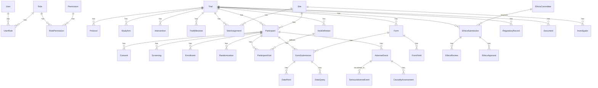

# Database Schema

## Overview

The AIIA CTMS uses PostgreSQL with 40+ tables organized into domain modules. All tables use:
- UUID primary keys
- `created_at` / `updated_at` timestamps
- Foreign key constraints
- Appropriate indexes
- Soft deletes (`is_deleted`) where applicable

## Entity Relationship Diagram

## Tables by Module

### Authentication & Authorization
| Table | Description |
|-------|-------------|
| users | System users with hashed passwords |
| roles | SUPER_ADMIN, TRIAL_ADMIN, PI, etc. |
| permissions | Granular resource:action permissions |
| user_roles | User-role assignments (optionally trial-scoped) |
| role_permissions | Role-permission mappings |

### Trial Management
| Table | Description |
|-------|-------------|
| trials | Clinical trial records |
| protocols | Protocol documents with versioning |
| study_arms | Treatment and control arms |
| interventions | Ayurveda interventions |
| trial_milestones | Key milestone tracking |

### Sites & Investigators
| Table | Description |
|-------|-------------|
| sites | Research site locations |
| investigators | Investigator qualifications |
| site_assignments | Trial-site-PI assignments |

### Participants
| Table | Description |
|-------|-------------|
| participants | Pseudonymous participant records |
| consents | Informed consent tracking |
| screenings | Screening results |
| enrollments | Enrollment records |
| randomizations | Immutable randomization assignments |
| withdrawals | Withdrawal records |

### Visits
| Table | Description |
|-------|-------------|
| visit_definitions | Protocol-defined visit schedule |
| participant_visits | Actual visit records |

### eCRF / EDC
| Table | Description |
|-------|-------------|
| forms | Form definitions |
| form_fields | Field definitions with validation |
| form_submissions | Completed form data |
| data_points | Individual data values |
| data_queries | Data clarification queries |

### Ethics
| Table | Description |
|-------|-------------|
| ethics_committees | IEC/IRB details |
| ethics_submissions | Submission tracking |
| ethics_reviews | Review records |
| ethics_approvals | Approval records with validity |
| protocol_amendments | Amendment tracking |

### Regulatory
| Table | Description |
|-------|-------------|
| regulatory_records | CTRI and regulatory tracking |
| regulatory_checklists | NDCT Rules 2019 compliance items |

### Pharmacovigilance
| Table | Description |
|-------|-------------|
| adverse_events | AE records |
| serious_adverse_events | SAE records with workflow |
| causality_assessments | Causality analysis |
| safety_signals | Detected safety signals |

### System
| Table | Description |
|-------|-------------|
| documents | Document metadata |
| audit_logs | Append-only audit trail |
| notifications | In-app notifications |
| cdisc_mappings | CDISC domain mappings |

## Key Constraints

- All `id` fields are UUID v4
- All tables have `created_at` (auto-set) and `updated_at` (auto-updated)
- Foreign keys use `ON DELETE RESTRICT` by default
- `audit_logs` table does not support UPDATE or DELETE operations
- `randomizations` become immutable after `is_locked = true`
- Participant `participant_id` is a pseudonymous identifier, not PII
